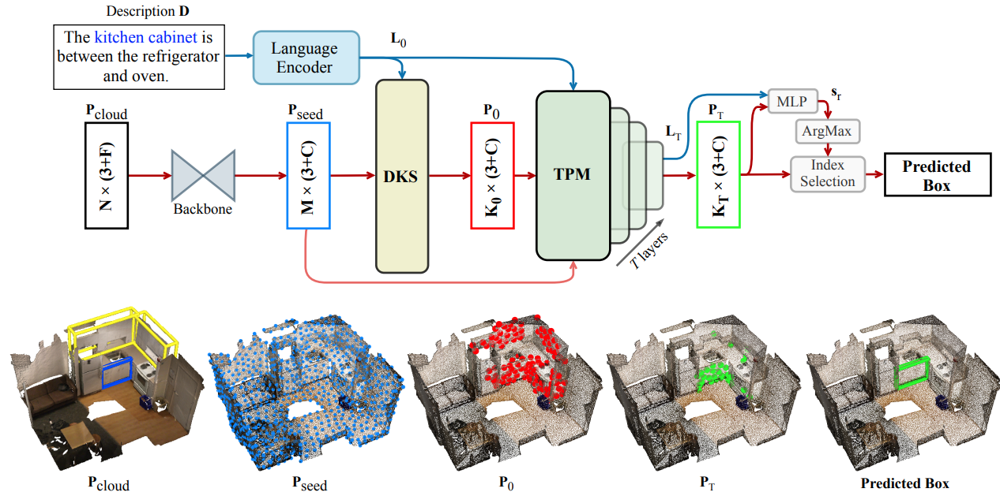

# 3D-SPS
Code for our CVPR 2022 Oral paper "3D-SPS: Single-Stage 3D Visual Grounding via Referred Point Progressive Selection".

[[`arXiv`](https://arxiv.org/pdf/2204.06272.pdf)] [[`BibTeX`](#CitingSPS)]

<div align="center">
  
</div><br/>

## Dataset

If you would like to access to the ScanRefer dataset, please fill out [this form](https://forms.gle/aLtzXN12DsYDMSXX6). Once your request is accepted, you will receive an email with the download link.

> Note: In addition to language annotations in ScanRefer dataset, you also need to access the original ScanNet dataset. Please refer to the [ScanNet Instructions](data/scannet/README.md) for more details.

Download the dataset by simply executing the wget command:
```shell
wget <download_link>
```

### Data format
```
"scene_id": [ScanNet scene id, e.g. "scene0000_00"],
"object_id": [ScanNet object id (corresponds to "objectId" in ScanNet aggregation file), e.g. "34"],
"object_name": [ScanNet object name (corresponds to "label" in ScanNet aggregation file), e.g. "coffee_table"],
"ann_id": [description id, e.g. "1"],
"description": [...],
"token": [a list of tokens from the tokenized description]
```

## Setup

The code is now compatiable with PyTorch 1.6! Please execute the following command to install PyTorch

```shell
conda install pytorch==1.6.0 torchvision==0.7.0 cudatoolkit=10.2 -c pytorch
```

Install the necessary packages listed out in `requirements.txt`:
```shell
pip install -r requirements.txt
```
After all packages are properly installed, please run the following commands to compile the CUDA modules for the PointNet++ backbone:
```shell
cd lib/pointnet2
python setup.py install
```
__Before moving on to the next step, please don't forget to set the project root path to the `CONF.PATH.BASE` in `config/default.yaml`.__

### Data preparation
1. Download the ScanRefer dataset and unzip it under `data/`. 
2. Download the text embeddings:
    * preprocessed [GLoVE embeddings (~990MB)](http://kaldir.vc.in.tum.de/glove.p) and put them under `data/`.
    * preprocessed [CLIP embeddings (~1.29MB)](https://github.com/openai/CLIP/blob/main/clip/bpe_simple_vocab_16e6.txt.gz) and put them under `data/`.

3. Download the ScanNetV2 dataset and put (or link) `scans/` under (or to) `data/scannet/scans/` (Please follow the [ScanNet Instructions](data/scannet/README.md) for downloading the ScanNet dataset).
> After this step, there should be folders containing the ScanNet scene data under the `data/scannet/scans/` with names like `scene0000_00`
4. Pre-process ScanNet data. A folder named `scannet_data/` will be generated under `data/scannet/` after running the following command. Roughly 3.8GB free space is needed for this step:
```shell
cd data/scannet/
python batch_load_scannet_data.py
```
> After this step, you can check if the processed scene data is valid by running:
> ```shell
> python visualize.py --scene_id scene0000_00
> ```
5. Download the pre-trained PointNet++ backbone ([`Google Drive`](https://drive.google.com/file/d/1oC-3mx104EReRqI4nTwjwkm9TZOy0lQM/view?usp=sharing) or [`Baidu Drive`](https://pan.baidu.com/s/1dlWUi86-fjZH3VQSH_MsSQ?pwd=likl)(`passcode: likl`)])
5. (Optional) Pre-process the multiview features from ENet. 

    a. Download [the ENet pretrained weights (1.4MB)](http://kaldir.vc.in.tum.de/ScanRefer/scannetv2_enet.pth) and put it under `data/`
    
    b. Download and decompress [the extracted ScanNet frames (~13GB)](http://kaldir.vc.in.tum.de/3dsis/scannet_train_images.zip).

    c. Change the data paths in `config.py` marked with __TODO__ accordingly.

    d. Extract the ENet features:
    ```shell
    python script/compute_multiview_features.py
    ```

    e. Project ENet features from ScanNet frames to point clouds; you need ~36GB to store the generated HDF5 database:
    ```shell
    python scripts/project_multiview_features.py --maxpool
    ```
    > You can check if the projections make sense by projecting the semantic labels from image to the target point cloud by:
    > ```shell
    > python scripts/project_multiview_labels.py --scene_id scene0000_00 --maxpool
    > ```

## Usage
### Training

```shell
python scripts/train.py --config ./config/default.yaml
```
For more training options (like using preprocessed multiview features), please see details in `default.yaml`.

### Evaluation
To evaluate the trained ScanRefer models, please download the trained model([`Google Drive`](https://drive.google.com/drive/folders/1hJOdcd75LPqrib94ciFn0ENFbFaF9Z49?usp=sharing) or [`Baidu Drive`](https://pan.baidu.com/s/1OhJrSLl72z5cweGRLr-fIQ?pwd=x3vl)(`passcode: x3vl`)]) and put it in the `<folder_name>` under `outputs/` and run :
```shell
python scripts/eval.py --config ./config/default.yaml --folder <folder_name> --reference --no_nms --force
```

## Acknowledgement
We would like to thank the authors of [ScanRefer](https://github.com/daveredrum/ScanRefer) and [Group-Free](https://github.com/zeliu98/Group-Free-3D) for their open-source release.

## License
`3D-SPS` is released under the [MIT license](LICENSE).

## <a name="CitingSPS"></a>Citation

Consider cite 3D-SPS in your publications if it helps your research.

```
@article{luo20223d,
  title={3D-SPS: Single-Stage 3D Visual Grounding via Referred Point Progressive Selection},
  author={Luo, Junyu and Fu, Jiahui and Kong, Xianghao and Gao, Chen and Ren, Haibing and Shen, Hao and Xia, Huaxia and Liu, Si},
  journal={arXiv preprint arXiv:2204.06272},
  year={2022}
}
```
